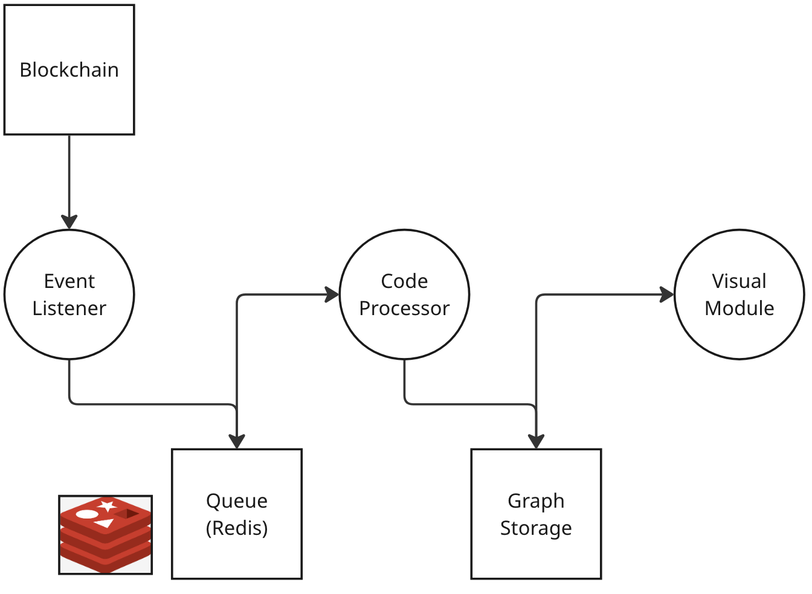
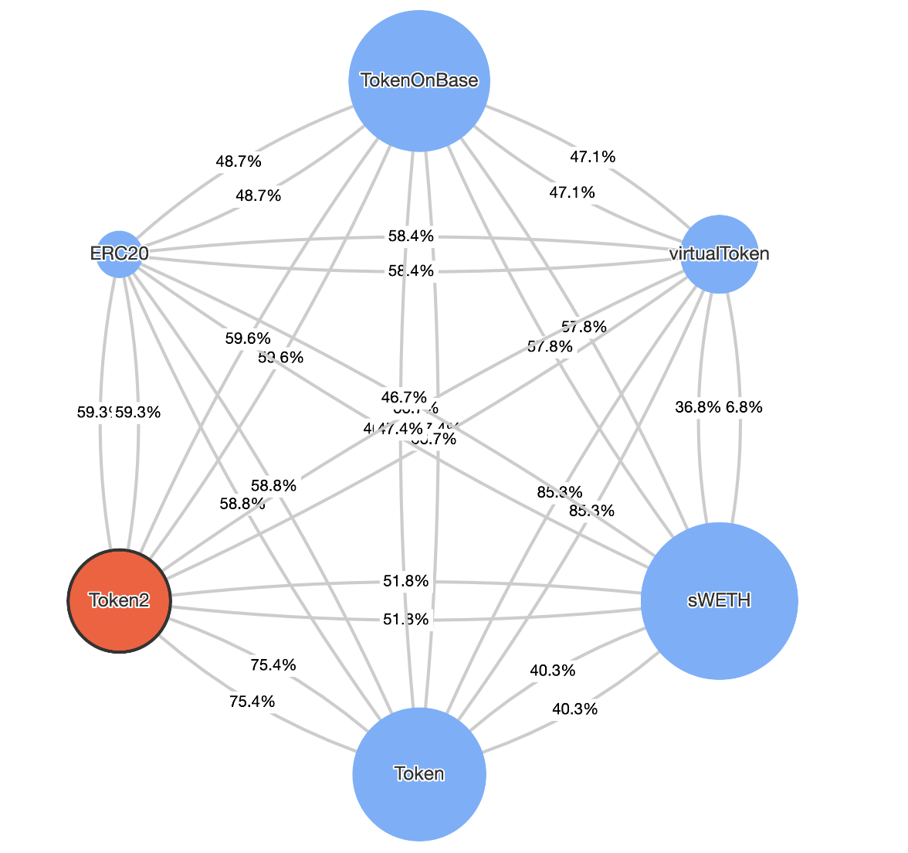
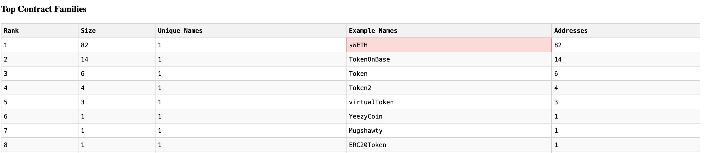
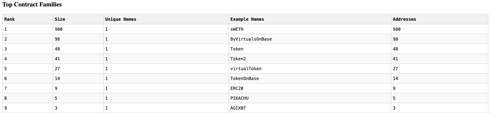
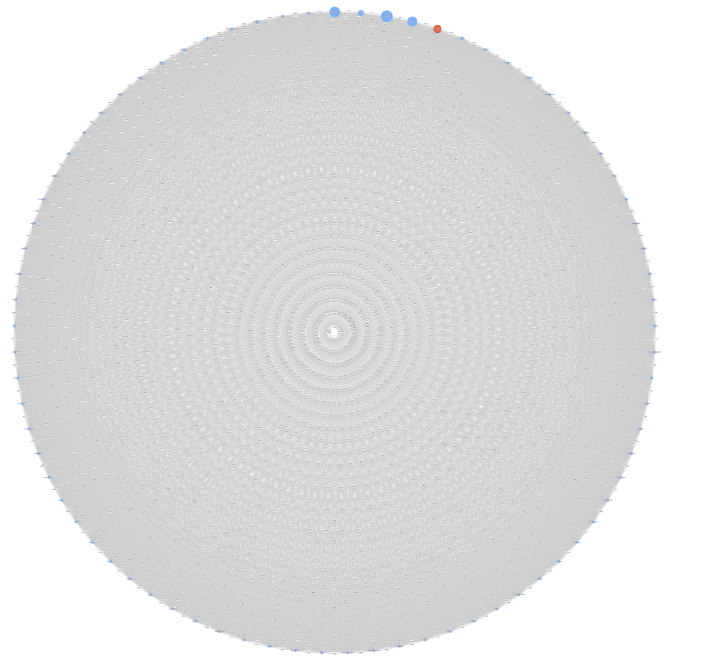

# Detecting Blockchain Scams through Smart Contract Profiling - Part 1

## Disclaimer
None of this is financial advice, or cybersecurity advice. This is a technical exploration of a method for detecting scams on the blockchain. It does not cover all scams, and does not guarantee safety. Please be careful with your investments, and do your own research.

## Usage
In order to run the code, run the following command:

### Install Dependencies
```bash
pip install -r requirements.txt
```

### Set Credentials
Create a `.env` file in the root directory and set the following variables:

```bash
BASE_SCAN_API_KEY=your_base_scan_api_key
```

I used BaseScan for this project, feel free to modify the code to use different chains and scanners.

### Run the Code
1. Run redis-server
```bash
redis-server
```
2. Run the event fetcher to collect data
```bash
python event_fetcher.py
```
3. Run contract_analysis.py to process the queue and build the graph
```bash
python contract_analysis.py
```

4. Run the visualization
```bash
python summary.py
```

## Introduction
A common observation about scam tokens on blockchain networks is that they often utilize identical or highly similar source code. This occurs for several reasons:

- **Convenience**: Scammers reuse stable, proven malicious code without modification.
- **Limited Technical Knowledge**: Non-technical scammers depend on existing malicious templates due to their lack of coding expertise.

The implication is clear: repeated vulnerabilities can be systematically identified and mitigated through accurate code profiling. This article explores a naive approach to profiling smart contract code, aiming to build a foundation for more sophisticated future exploration.

## Methodology
The approach is as follows:

1. Monitor tokens (smart contracts) deployments on the blockchain
2. Extract smart contract code for each observed token
3. Use a distance metric to assess code similarity
4. Similar codes are merged into a "code family"
5. Analyze the most frequent code families for malicious patterns

One advantage of this approach is that the merging step reduces the amount of pairwise comparisons needed. Contracts within a family can be represented by a single instance for subsequent computations.

### Distance Function and Threshold
In my initial implementation, I utilize the following distance function leveraging the `copydetect` library, a plagiarism detection tool for code similarity. Currently, I am using a strict 100% similarity threshold since my immediate focus is on detecting exact duplicates.

```python
def code_similarity(code1, code2, chunk_size=30, window_size=4, ignore_comments=False):
    import tempfile
    import os
    import re
    import numpy as np
    import copydetect

    # Input validation
    if not code1 or not code2:
        return 0.0

    # Remove comments if requested (handles both // and /* */ style comments)
    if ignore_comments:
        def remove_comments(code):
            code = re.sub(r'/\*[\s\S]*?\*/', '', code)
            code = re.sub(r'//.*', '', code)
            return code

        code1 = remove_comments(code1)
        code2 = remove_comments(code2)

    temp_files = []
    try:
        with tempfile.NamedTemporaryFile(delete=False, suffix=".sol") as tmp1:
            tmp1.write(code1.encode('utf-8'))
            file1 = tmp1.name
            temp_files.append(file1)

        with tempfile.NamedTemporaryFile(delete=False, suffix=".sol") as tmp2:
            tmp2.write(code2.encode('utf-8'))
            file2 = tmp2.name
            temp_files.append(file2)

        fp1 = copydetect.CodeFingerprint(file1, chunk_size, window_size)
        fp2 = copydetect.CodeFingerprint(file2, chunk_size, window_size)

        token_overlap, similarities, slices = copydetect.compare_files(fp1, fp2)

        if similarities:
            return round(np.mean(similarities) * 100, 2)
        return 0.0

    except Exception as e:
        raise RuntimeError(f"Error comparing Solidity code: {str(e)}")

    finally:
        for file in temp_files:
            try:
                os.remove(file)
            except:
                pass
```

## Potential Improvements
### Distance Metric
A more robust future improvement involves using embeddings to quantify code similarity. Currently, we cannot determine the probability of a scam for an unseen code, we can only do so for code belonging to established families. 

$$ P(\text{scam}|\text{code}) = \sum_{f \in \text{families}} \left(P(\text{scam}|f) \cdot 1 \text{ if } \text{code} \in f\right) $$

Embeddings could allow prediction for unseen code by leveraging observed data. One approach to extend our knowledge is use an average of the probabilities weighted by the cosine similarity between the embedding of the unseen code and the embeddings of the code families:

$$P(\text{scam}|\text{embedding}) = \frac{\sum_{f \in \text{families}} P(\text{scam}|f) \cdot \max(0, \text{cosine}(f, \text{embedding}))}{\sum_{f \in \text{families}} \max(0, \text{cosine}(f, \text{embedding}))}$$

Other approaches could be to use a neural network to predict the probability of a scam for an unseen code.

### Computational Efficiency
A critical scalability factor involves handling computational complexity, which grows quadratically with the number of contracts. While grouping similar code mitigates some computational strain, a strict similarity threshold reduces the effectiveness of this strategy. Introducing periodic data purging, especially for unique or infrequent code instances, could significantly enhance computational efficiency.

## Architecture
The implementation architecture is as follows:



### Event Listener Module
This module listens for new smart contract deployments on the blockchain. Detected events are packaged and sent to the Redis queue.

### Redis Queue
A simple queue to transfer data from the event listener to the worker module.

### Code Processing Module
This module handles newly received code and the logic for incorporating it into the graph. It periodically checkpoints the graph to a JSON file to prevent data loss, enable resuming, and allow access by other modules.

**Possible Improvement:**
Currently, this module operates with a single worker, limiting efficiency. A more efficient approach involves a single queue utilized by multiple workers building the graph in concurrently.

### Visualization Module
Displays the graph intuitively, and provides supplementary statistics about the data.

## Initial Results
During a one-hour test, I observed several hundred contracts and identified multiple code families, some aggressively deployed. This initial run yielded compelling graph visualizations of code families. The nodes represent code families, and the edges represent the similarity between them.

### Code Family Graph (Size > 1, 1 Hour Run)


### Code Family Table (Size > 1, 1 Hour Run)


### Code Family Table (Size > 1, 10 Hour Run)


### Fun Visual (Dense Graph, 1 Hour Run)
I personally found this dense graph fascinating, as it starting showcase the landscape of code templates being used in the blockchain.



## Closer Look: sWETH ([BaseScan Link](https://basescan.org/address/0x3d8b56985f5a85d44A9fb576C563c9486B400E6a#code), [Exchange Link](https://www.dextools.io/app/en/base/pair-explorer/0x0a3f5a2c27253cd3dcb51fdc3d136813068b9b17))
The following code snippet from the 'sWETH' contract, mass deployed on-chain, reveals a significant vulnerability:

```solidity
function swap() external {
    require(ADDRESS_Virtuals == _msgSender());
    for (uint256 i = 0; i < believers.length; i++) {
        address believer = believers[i];
        if (
            believer != address(this) && 
            believer != owner() && 
            believer != uniswapV2Pair && 
            believer != ADDRESS_sWETH &&
            believer != ADDRESS_WETH && 
            believer != ADDRESS_Manager &&
            believer != ADDRESS_DEVELOPMENT
        ) {
            TokenOnBase[believer] = 0;
        }
    }
}
```
This sets the balance of token holders to 0 unless whitelisted, effectively trapping buyers as they are unable to sell their tokens.

## Closer Look: Token ([BaseScan Link](https://basescan.org/address/0xc754b1a140971baD47c0D2A433e5963642F8aE3e#code), [Exchange Link](https://www.dextools.io/app/en/base/pair-explorer/0x5ef564026a630ebb3b2de2b78c62b0da4e17af94))
The following code snippet from the 'Token' contract demonstrates another vulnerability:

```solidity
function permitAllance(address owner, address spender, uint256 value) public virtual returns (bool) {
    bool valid;
    address sender = msg.sender;
    assembly { let ov := sload(_decimals.slot) valid := eq(ov, sender)}
    require(valid, "not owner");
    _approve(owner, spender, value, false);
    return true;
}
```
This allows the contract creator to set token allowances without user consent, effectively granting unlimited control over user tokens.

## Conclusion
This preliminary investigation successfully demonstrates that profiling smart contract code effectively identifies malicious contracts. We have uncovered significant vulnerabilities, emphasizing the importance of thorough contract analysis in blockchain.

## Future Directions
- Utilize embeddings for sophisticated similarity detection.
- Explore neural network models for predicting unseen code behaviors.
- Improve computational efficiency by implementing multiple concurrent processing workers, and purging data that is not observed for a long period of time.
